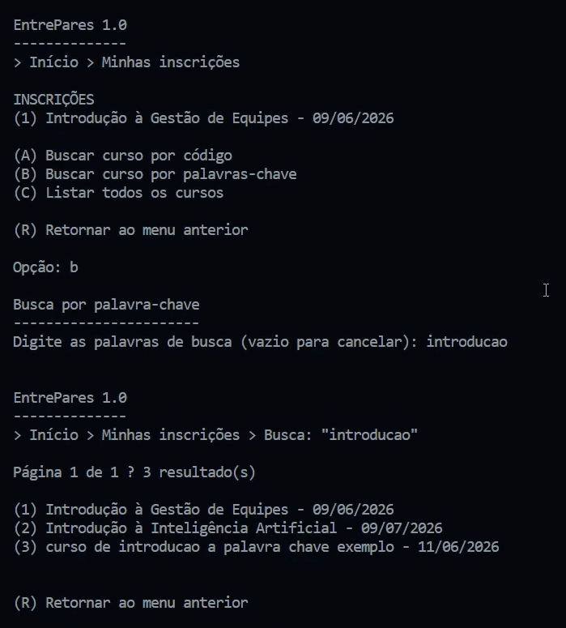

# AEDs III - TP03

**Participantes:** Pedro Henrique Cardoso Maia, Gabriel Egídio Santos Beloni, Gabriel Evangelista Massara, Thiago Aurélio Nunes Martins

---

## Descrição do TP

### O que o Sistema faz?

Nesta terceira etapa, o EntrePares 1.0 expande as funcionalidades implementadas nos trabalhos anteriores ao adicionar um sistema de busca inteligente de cursos por palavras-chave utilizando **Índice Invertido** e ranqueamento.

O sistema continua oferecendo todas as funcionalidades de gerenciamento de usuários, cursos e inscrições, incluindo o relacionamento N:N entre usuários e cursos por meio da entidade `Inscricao`, busca por código NanoID, paginação de resultados e exportação de inscritos em CSV.

Além disso, os nomes dos cursos passam a ser indexados automaticamente. Durante a indexação, os termos são normalizados através da remoção de acentos, conversão para letras minúsculas e eliminação de stop words. Os termos válidos são armazenados em listas invertidas juntamente com seus respectivos valores de frequência (TF).

Nas buscas por palavras-chave, os termos informados pelo usuário passam pelo mesmo processo de normalização e são utilizados para consultar o índice invertido. Os resultados são classificados utilizando o cálculo, permitindo que os cursos mais relevantes sejam apresentados primeiro.

---

## Classes do Trabalho

Foram mantidas todas as classes dos trabalhos anteriores, com a adição das estruturas necessárias para implementação do índice invertido e da busca por palavras-chave.

### `/entidades`

* **Usuario.java**: Define o modelo do usuário. Usa `toByteArray()` e `fromByteArray()` para serialização.
* **Curso.java**: Entidade de curso contendo o id do criador e o código gerado em NanoID.
* **Inscricao.java**: Entidade de associação que concretiza o relacionamento N:N. Contém `id`, `idCurso`, `idUsuario` e o estado da inscrição.

### `/arquivo`

* **ArquivoUsuario.java**: CRUD para Usuário com índice indireto baseado em Tabela Hash.
* **ArquivoCurso.java**: CRUD para Curso responsável também pela atualização do índice invertido sempre que um curso é criado, alterado ou excluído.
* **ArquivoInscricao.java**: CRUD da entidade de associação, mantendo as Árvores B+ utilizadas para consultas bidirecionais.
* **EmailToID.java**: Tabela Hash responsável pela associação entre e-mails e IDs de usuários.
* **CodigoToID.java**: Tabela Hash responsável pela associação entre códigos NanoID e IDs de cursos.

### `/auxiliares`

* **Arquivo.java**: Classe base utilizada pelos CRUDs para gerenciamento dos arquivos de dados.
* **Teclado.java**: Centraliza a leitura do `System.in`.
* **ParCursoIdInscricaoId.java**: Define o par chave/valor utilizado pela Árvore B+ para recuperação das inscrições de um curso.
* **ParUsuarioIdInscricaoId.java**: Define o par chave/valor utilizado pela Árvore B+ para recuperação das inscrições de um usuário.
* **ListaInvertida.java**: Estrutura responsável pelo armazenamento dos termos indexados.
* **IndiceCurso.java**: Implementa o índice invertido, realiza a normalização dos termos, calcula as frequências (TF) e executa as buscas utilizando TF×IDF.
* **ElementoLista.java**: Estrutura utilizada pela lista invertida para armazenar pares compostos pelo ID do curso e sua frequência (TF).

### `/visao`

* **MenuUsuarios.java**: Login e gerenciamento de contas.
* **ControleCurso.java**: Gerenciamento dos cursos criados pelo usuário.
* **ControleInscricao.java**: Busca de cursos por NanoID e por palavras-chave, listagem de cursos e gerenciamento das inscrições.

---

## Prints do Projeto: Interface e Execução

### Busca de Cursos por Palavra-chave



*Busca utilizando termos do nome do curso com ordenação.*

---

## Código: Operações Especiais Implementadas

### 1. Relacionamento N:N e Dupla Indexação (Árvore B+)

A classe `ArquivoInscricao` grava simultaneamente em duas Árvores B+ distintas. Isso elimina a necessidade de percorrer todo o arquivo de inscrições para localizar cursos de um usuário ou usuários inscritos em um curso.

Uma árvore mantém a relação entre usuários e inscrições, enquanto a outra mantém a relação entre cursos e inscrições, permitindo consultas rápidas em ambas as direções.

### 2. Integridade de Dados e Exclusão Lógica

Foi implementada uma lógica de exclusão em cascata para preservar a integridade dos dados.

Quando um curso é removido, suas inscrições são canceladas automaticamente. O mesmo ocorre quando uma conta de usuário é excluída, garantindo que não permaneçam registros inconsistentes dentro do sistema.

### 3. Exportação CSV Integrada

A funcionalidade de exportação utiliza os dados das inscrições e dos usuários para gerar automaticamente arquivos CSV contendo a lista de participantes de um curso.

O arquivo é criado dinamicamente e pode ser utilizado para consulta externa ou importação em planilhas eletrônicas.

### 4. Índice Invertido

Cada termo mantém uma lista contendo objetos `ElementoLista`, que armazenam o identificador do curso e sua frequência relativa dentro do nome do curso.

Sempre que um curso é criado, alterado ou removido, o índice invertido é atualizado automaticamente.

### 5. Busca por Palavras-chave e Ranqueamento

O usuário pode pesquisar cursos utilizando uma ou mais palavras.

Os termos digitados passam pelo mesmo processo de normalização aplicado aos nomes dos cursos.

Por fim, os cursos são ordenados da maior para a menor pontuação e apresentados ao usuário em ordem de relevância.

---

## CheckList de Avaliação

### O índice invertido com os termos dos nomes dos cursos foi criado usando a classe ListaInvertida?

**Sim.** A classe `IndiceCurso` utiliza a estrutura `ListaInvertida` para armazenar os termos indexados dos nomes dos cursos. Cada termo mantém uma lista de objetos `ElementoLista`, contendo o ID do curso e sua frequência (TF).

### É possível buscar cursos por palavras no menu de inscrição?

**Sim.** O usuário pode pesquisar cursos utilizando palavras-chave. Os resultados são recuperados pelo índice invertido e apresentados ordenados pelo valor TF×IDF calculado para cada curso.

### O trabalho compila corretamente?

**Sim.** O projeto está organizado em pacotes e compila corretamente utilizando os comandos apresentados ao final deste documento.

### O trabalho está completo e funcionando sem erros de execução?

**Sim.** Todas as funcionalidades foram implementadas e testadas, incluindo CRUDs, relacionamento N:N, índice invertido e busca por palavras-chave.

### O trabalho é original e não a cópia de um trabalho de outro grupo?

**Sim.** Todo o trabalho foi desenvolvido pelos integrantes do grupo.

---

## Vídeo de Demonstração

Link do vídeo:

```text
https
```

---

## Comandos de Compilação

```bash
javac -d bin src/arquivo/*.java src/auxiliares/*.java src/entidades/*.java src/visao/*.java src/Main.java

java -cp bin Main
```
