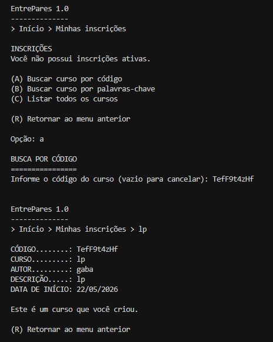
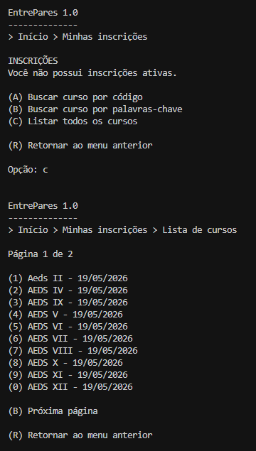
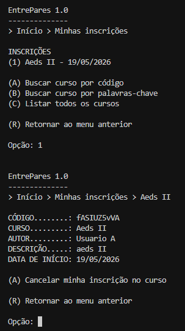
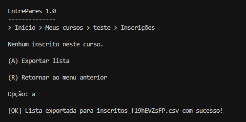

# AEDs III - TP02

**Participantes:** Pedro Henrique Cardoso Maia, Gabriel Egídio Santos Beloni, Gabriel Evangelista Massara, Thiago Aurélio Nunes Martins

---

## Descrição do TP

**O que o Sistema faz?**
Nesta segunda etapa, o EntrePares 1.0 expande sua base de dados randômica (`.db`) para suportar a funcionalidade de **Inscrições**. O sistema agora gerencia um relacionamento N:N entre Usuários e Cursos através da nova entidade de associação `Inscricao`. Além do uso contínuo de Tabelas Hash Extensíveis e lápides para reaproveitamento de espaço, o projeto utiliza intensamente as Árvores B+ para indexação bidirecional (Cursos <-> Usuários). Foram implementadas buscas otimizadas por código (NanoID), paginação na listagem de cursos disponíveis, visualização detalhada e exportação de inscritos no formato CSV.

---

## Classes do Trabalho

Foram mantidas as classes do TP1 com a adição de novas estruturas para lidar com o relacionamento N:N e as inscrições.

### `/entidades`
*   **Usuario.java**: Define o modelo do usuário. Usa `toByteArray()` e `fromByteArray()` para serialização.
*   **Curso.java**: Entidade de curso contendo o id do criador e o código gerado em NanoID.
*   **Inscricao.java** *(Novo)*: Entidade de associação que concretiza o relacionamento N:N. Contém `id` próprio, `idCurso` (chave estrangeira), `idUsuario` (chave estrangeira) e o estado da inscrição (ativa ou cancelada).

### `/arquivo`
*   **ArquivoUsuario.java**: CRUD para Usuário com índice indireto baseado em Tabela Hash (EmailToID).
*   **ArquivoCurso.java**: CRUD para Curso gerenciando Hash e Árvores B+ para ordenação e relacionamento 1:N.
*   **ArquivoInscricao.java** *(Novo)*: CRUD da entidade de associação. Mantém e atualiza duas Árvores B+ essenciais: `indiceUsuarioInscricao` e `indiceCursoInscricao`.
*   **EmailToID.java** / **CodigoToID.java**: Tabelas Hash que garantem unicidade de emails e códigos NanoID.

### `/auxiliares`
*   **Arquivo.java**: Base do CRUD, controle de exclusão (lápide) e reaproveitamento de registros.
*   **Teclado.java** *(Novo)*: Centraliza a leitura do `System.in` para evitar conflitos de Scanner.
*   **ParCursoIdInscricaoId.java** *(Novo)*: Define o par de chave/valor para a Árvore B+ que permite buscar as inscrições (alunos) de um curso específico.
*   **ParUsuarioIdInscricaoId.java** *(Novo)*: Define o par de chave/valor para a Árvore B+ que permite buscar as inscrições ativas (cursos) de um usuário específico.
*   *(Demais pares do TP1 mantidos, como `ParNomeIdCurso`, e as classes `ArvoreBMais`, `HashExtensivel`, etc.)*

### `/visao`
*   **MenuUsuarios.java**: Login e gerenciamento de conta, verificando integridade de exclusão.
*   **ControleCurso.java**: Navegação e operações de "Meus Cursos", agora incluindo a opção de exportar a lista de inscritos em `.csv`.
*   **ControleInscricao.java** *(Novo)*: Centraliza as buscas de curso por palavra-chave e NanoID, a listagem paginada de cursos disponíveis e a gestão das próprias inscrições do usuário logado.

---

## Prints do Projeto: Interface e Execução


1.  **Busca de Curso por NanoID**
    
    
    
    *Tela exibindo os dados de um curso retornado após a busca pelo seu código exclusivo.*

2.  **Lista de Cursos e Paginação**
    
    
    
    *Listagem de cursos ordenada por data de início, com paginação funcional.*

3.  **Gestão das Próprias Inscrições**
    
    
    
    *Visão de um curso em que o usuário está matriculado, com a opção ativa para "Cancelar minha inscrição no curso".*

4.  **Gestão de Inscritos e Exportação CSV**
    
    
    
    *Visão do criador do curso, listando os alunos matriculados e exportando o arquivo `inscritos_[NanoID].csv`.*

---

## Código: Operações Especiais Implementadas

1.  **Relacionamento N:N e Dupla Indexação (Árvore B+)**
    *A classe `ArquivoInscricao` grava simultaneamente em duas Árvores B+ distintas. Isso elimina a necessidade de varrer o arquivo `.db` linearmente: usamos `indiceUsuarioInscricao` para as inscrições do aluno e `indiceCursoInscricao` para ver os alunos do curso.*

2.  **Integridade de Dados e Exclusão Lógica**
    *Foi implementada uma lógica de exclusão em cascata: ao deletar um curso, o método `cancelarInscricoesPorCurso` inativa as inscrições daquele curso. O mesmo ocorre ao excluir a conta de um usuário (apenas permitido caso ele não tenha cursos que ele próprio criou ativos).*

3.  **Exportação CSV Integrada**
    *Implementada no método `exportarListaCSV`, a função cruza os dados extraídos das inscrições com os dados do Arquivo de Usuários, escrevendo "Nome,Email,Data" diretamente na raiz do projeto, nomeado pelo NanoID do curso.*

---

## CheckList de Avaliação

*   **Há um CRUD da entidade de associação CursoUsuario (que estende a classe ArquivoIndexado, acrescentando Tabelas Hash Extensíveis e Árvores B+ como índices diretos e indiretos conforme necessidade) que funciona corretamente?**
    **Sim.** O CRUD foi implementado na classe `ArquivoInscricao`, responsável por inserir, ler, atualizar e excluir inscrições. A classe gerencia simultaneamente duas Árvores B+ para buscas bidirecionais (Usuario -> Inscricao e Curso -> Inscricao).

*   **A visão de inscrições está corretamente implementada e permite consultas aos cursos em que um usuário está inscrito?**
    **Sim.** Em `ControleInscricao`, o sistema navega pela Árvore B+ vinculada ao usuário atual (`readByUsuario`), resgata os IDs e exibe apenas os cursos matriculados com a opção de cancelamento.

*   **A visão de cursos funciona corretamente e permite a gestão dos usuários inscritos em um curso?**
    **Sim.** No `ControleCurso`, o dono do curso acessa a lista de alunos matriculados, podendo verificar detalhes do aluno, cancelar inscrições individuais ou exportar a listagem em CSV.

*   **Há uma visualização dos cursos de outras pessoas por meio de um código NanoID?**
    **Sim.** Utilizando a tabela de códigos, o usuário insere o NanoID e é levado para a visualização dos detalhes (em `VisaoCurso.mostraCursoInscricao`), habilitando a matrícula.

*   **A integridade do relacionamento entre cursos e usuários está mantida em todas as operações?**
    **Sim.** As operações garantem que se um curso for cancelado ou o usuário deletar a conta, as conexões no arquivo `Inscricoes` recebem o estado "Cancelada", preservando a integridade.

*   **O trabalho compila corretamente?**
    **Sim.** O código, as pastas e os pacotes estão estruturados de forma coerente e compilam via `javac` sem acusar erros.

*   **O trabalho está completo e funcionando sem erros de execução?**
    **Sim.** O ciclo completo de criação, relacionamento N:N e listagens foi testado no terminal.

*   **O trabalho é original e não a cópia de um trabalho de outro grupo?**
    **Sim.** O trabalho foi redigido e codificado pelo grupo listado no cabeçalho.

---

**Vídeo de Demonstração:** // tem que colocar o link aqui do vídeo

**Comandos de Compilação:**

```bash
javac -d bin src/arquivo/*.java src/auxiliares/*.java src/entidades/*.java src/visao/*.java src/Main.java
java -cp bin Main
```